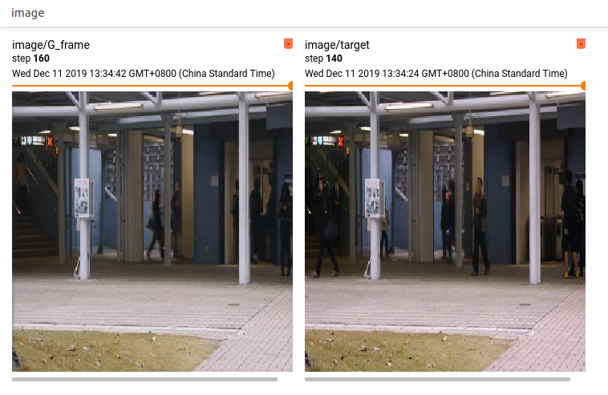
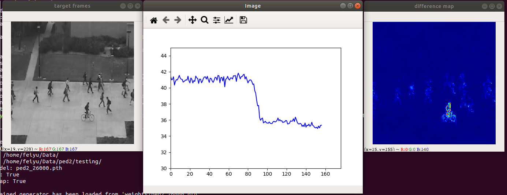

# Anomaly_Prediction
Pytorch implementation of anomaly prediction for CVPR2018:[Future Frame Prediction for Anomaly Detection – A New Baseline](https://arxiv.org/pdf/1712.09867.pdf).  
This implementation used lite-flownet instead of Flownet2SD and the generator network is slightly different.  
I only trained the ped2 and avenue datasets, the results:  

|     AUC                  |USCD Ped2    |CUHK Avenue         |
|:------------------------:|:-----------:|:------------------:|
| original implementation  |95.4%        | 84.9%              |
|  this  implementation    |95.6%        | 84.6%              |

### The network pipeline.  


## Environments  
PyTorch >= 1.1.  
Python >= 3.6.  
tensorboardX  
cupy  
sklearn  
Other common packages.  

## Prepare
- Download the ped2 and avenue datasets.  

|USCD Ped2                                                                            | CUHK Avenue                                                                           |
|:-----------------------------------------------------------------------------------:|:-------------------------------------------------------------------------------------:|
|[Google Drive](https://drive.google.com/open?id=1PO5BCMHUnmyb4NRSBFu28squcDv5VWTR)   | [Google Drive](https://drive.google.com/open?id=1jAlQD46KCN0ZTRFajHWUqawGxsCtXu8U)    |
|[Baidu Cloud: e0qj](https://pan.baidu.com/s/1HqDBczQn6nr_YUEoT9NnLA)                 | [Baidu Cloud: eqmu](https://pan.baidu.com/s/1FaduWLhj0CF4Fl8jPTl-mQ)                  |

- Modify 'data_root' in `config.py`, and then unzip the datasets under your data root.
- Download the trained weights and put them under the 'weights' folder.  

|ped2_26000.pth                                                                      | avenue_.pth  |
|:----------------------------------------------------------------------------------:|:-------------------------------------------------------------------:|
| [Google Drive](https://drive.google.com/open?id=1dgeoZoiO0V_Wql6k7w_tGFDyiaxroGeo) |[Google Drive](https://pan.baidu.com/s/1XDeDwg1Xw9GJCucJNqdNZw)      |
| [Baidu Cloud: 5hu9](https://pan.baidu.com/s/1y5pHwU0qSmbLmlSGni-93w)               |[Baidu Cloud: e0qj](https://pan.baidu.com/s/1uX_v1RPISxgwQ2LdsbJrJQ) |

## Train
```Shell
# Train by default with specified dataset.
python train.py --dataset=avenue
# Train with different batch_size, you might need to tune the learning rate by yourself.
python train.py --dataset=avenue --batch_size=16
# Set the max training iterations.
python train.py --dataset=avenue --iters=80000
# Set the save interval and the validation interval.
python train.py --dataset=avenue --save_interval=2000 --val_interval=2000
# Resume training with the latest trained model or a specified model.
python train.py --dataset=avenue --resume latest [or avenue_10000.pth]
# Train with Flownet2SD instead of lite-flownet.
python train.py --dataset=avenue --flownet=2sd
# Visualize the optic flow during training.
python train.py --dataset=avenue --show_flow
```
## Use tensorboard
```Shell
tensorboard --logdir=tensorboard_log/ped2_bs4
```


## Evalution
```Shell
# Validate with a trained model.
python evaluate.py --dataset=ped2 --trained_model=ped2_26000.pth
# Show and save the psnr curve and the difference heatmap between the gt frame and the 
# generated frame during evaluating. This drops fps.
python evaluate.py --dataset=ped2 --trained_model=ped2_26000.pth --show_curve --show_heatmap
```

